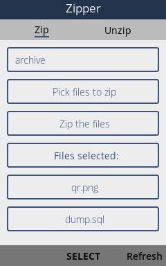
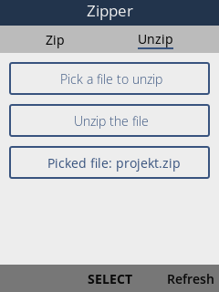

# Zipper

Archivizer for KaiOS devices. Tested for KaiOS 2.5.\*




[**Download**](https://store.bananahackers.net/#zipper)

## Development

### Setup

```
npm install
```

### Compilation

Run `npm run dev` to compile with hot-reloading for development. When you are done with the changes run the `./build.sh` script to compile and build the app. Now you can install the app on your phone with WEBIDE:

1. Click on the `Open Packaged App` button
2. Select the `dist/` directory
3. Connect your device via adb
4. Select your device from the right sidebar under `USB DEVICES`
5. Select the app from the left sidebar and click the `Install and run button`

The `Zipper.zip` file is a packaged version installable from [BananaHackers](https://store.bananahackers.net/#zipper)
